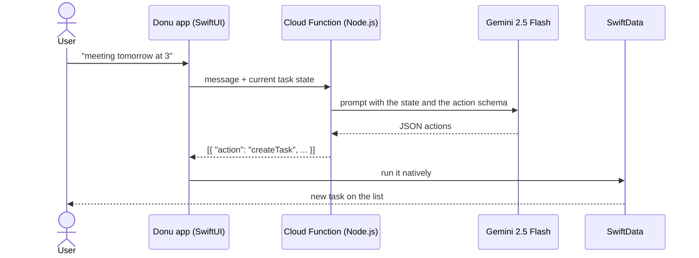
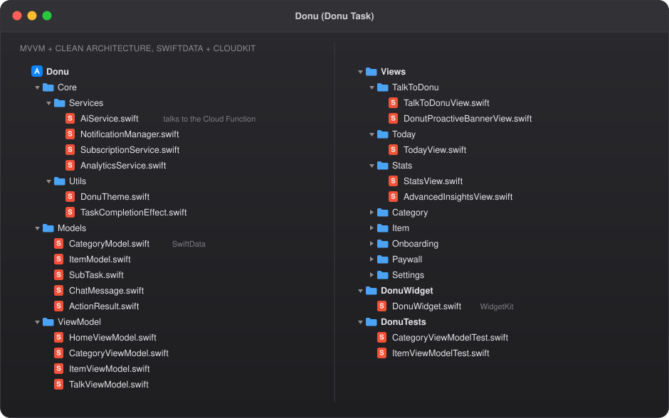

> 🔒 **The source code is private.** This repo explains what the app does, how it is built and the main decisions I made. I'm happy to walk through the real code in an interview.

## What it is

Donu Task is a task manager for iPhone with a built in AI assistant called Donu. You can tap through the app like any to do list, or just write what you need:

> _"meeting tomorrow at 3"_
> _"create a work category with my Monday tasks"_

Donu understands the sentence and the app does the work: it creates the task, sets the date and time, or moves things around.

## Features

- 🤖 **Talk to Donu.** Natural language becomes real actions inside the app.
- 📴 **Offline first.** Everything is saved on the device with SwiftData. No internet needed to use the app.
- ☁️ **Sync with iCloud.** CloudKit keeps tasks in sync between devices.
- 📅 **Today view, categories and routines** to plan the day.
- 📊 **Progress stats** with Swift Charts.
- 🧩 **Home screen widget** with WidgetKit.
- 🔔 **Reminders** with local notifications.
- 🖼️ **Share your progress** as an image with `ImageRenderer`.
- ✨ **Polish:** custom animations, haptics, onboarding and full dark mode.
- 💎 **Premium plan** with a paywall built on StoreKit.
- 🌎 **More than one language** with String Catalogs.

## How the AI works

The AI never touches the database directly. It only suggests actions, and the app decides how to run them.

**Why it works this way**

- **The model gets the full task state on every request**, so it knows what already exists. "Move my Monday tasks to Friday" works because Donu can see those tasks.
- **Structured JSON output** instead of free text. The app only runs actions it knows, so a strange answer from the model does not turn into random changes.
- **The API key stays on the server.** The app only talks to the Cloud Function, never to Gemini directly.
- **Actions run in SwiftData on the device**, so the result is instant and still works with CloudKit sync.

## Architecture

**MVVM with Clean Architecture.** Data, domain and presentation are separate layers.

  

The real folder structure of the app. Only file names are shown, the code stays private.

## Quality

- ViewModel tests for categories and items.
- Every release goes through **Swift Testing** and **TestFlight** before the App Store.

## Tech stack

| Area | Tools |
|---|---|
| UI | SwiftUI, Swift Charts, custom animations, haptics |
| Data | SwiftData (offline first), CloudKit sync |
| AI | Gemini 2.5 Flash through Firebase Cloud Functions (Node.js) |
| Extensions | WidgetKit, UserNotifications, ImageRenderer |
| Payments | StoreKit |
| Architecture | MVVM, Clean Architecture |
| Testing | Swift Testing, XCTest, TestFlight |

## Screenshots

_Coming soon._

---

Built by [Charles Yamamoto](https://github.com/Lophiester) · [LinkedIn](https://www.linkedin.com/in/charles-yamamoto-26699b203/) · [yamaflare.com](https://yamaflare.com)

